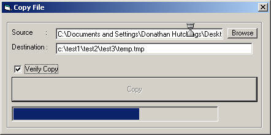



## File Copy Class \(Updated\)

### Description

I have added an automatic detection of the target path. If it doesn't exist, created regardless of the depth. I have also added a verify feature to verify the copy was successful. Orig. Desc.

This is a modified verision of Nabhan Ahmed's (Copy File byte by byte) found at http://www.Planet-Source-Code.com/vb/scripts/ShowCode.asp?txtCodeId=48319&lngWId=1. Please give all votes to him.

His description

Basically, this program shows you how to copy files byte by byte. Everytime it reads 4 kbs from the source file and write them in the destination file until it reads all bytes in the srouce file. There is a bar that shows the copying progress, and there is a label that shows the copying percentage. In the new update, you can use the browse button to find the source file you want to copy. I'm sure you'll find the code very easy to understand, and that you'll like it.( Would you please vote for this code )

My Changes:

The FileCopy routine was transfered to a self contained class. It checks for proper input for the FileCopy method to work. It is now completey

portable.
 
### More Info
 

             |
---                |---
**Submitted On**   |2003-09-13 08:46:40
**By**             |[Donathan Hutchings](https://github.com/Planet-Source-Code/PSCIndex/blob/master/ByAuthor/donathan-hutchings.md)
**Level**          |Intermediate
**User Rating**    |5.0 (15 globes from 3 users)
**Compatibility**  |VB 5\.0, VB 6\.0
**Category**       |[Files/ File Controls/ Input/ Output](https://github.com/Planet-Source-Code/PSCIndex/blob/master/ByCategory/files-file-controls-input-output__1-3.md)
**World**          |[Visual Basic](https://github.com/Planet-Source-Code/PSCIndex/blob/master/ByWorld/visual-basic.md)
**Archive File**   |[File\_Copy\_1644949132003\.zip](https://github.com/Planet-Source-Code/donathan-hutchings-file-copy-class-updated__1-48462/archive/master.zip)

